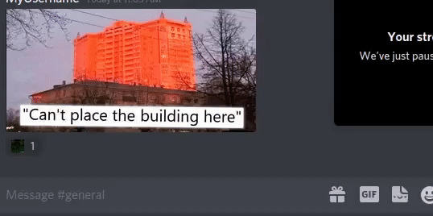

#CLIPBot

Simple python discord bot that puts reactions on images based on the servers emoji names.

****

##Installation

1. Clone the git repo
2. pip install -r requirements.txt
3. Start the database with the command: `python3 setup.py`
4. Add your bot's token to the .env file under the `DISCORD_TOKEN` variable
5. Run the bot with the following command: `python3 main.py`

***

##Usage

Any image posted on the server will be scanned and the corresponding reactions will be added!

Example:

You can also run `.help` to see the commands.
